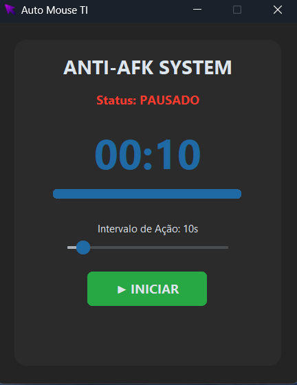

# 🖱️ Auto Mouse TI (Anti-AFK System)


Uma aplicação Desktop leve e moderna desenvolvida em Python para prevenir inatividade do sistema. O **Auto Mouse TI** simula micro-movimentos do mouse e cliques de teclado em intervalos configuráveis, impedindo bloqueios de tela automáticos (Screensavers/Sleep Mode) ou expulsões por AFK em jogos e aplicações.

## 📸 Visual da Aplicação

<div align="center">
  
</div>

## 🚀 Funcionalidades Principais

* **Interface Moderna:** UI em Dark Mode construída com `customtkinter`, apresentando um visual limpo de "cartão".
* **Temporizador Dinâmico:** Relógio em tempo real com barra de progresso visual que indica exatamente quando a próxima ação ocorrerá.
* **Intervalo Customizável:** Slider intuitivo para ajustar a frequência das ações (de 5 a 60 segundos) sem precisar pausar a ferramenta.
* **Multithreading:** As ações do mouse são executadas em uma thread separada (`daemon`), garantindo que a interface e o cronômetro nunca congelem.
* **Ação Híbrida:** Combina o movimento relativo do mouse (eixo X) com o pressionamento de teclas (`a`) para garantir o bypass em diferentes tipos de sistemas de detecção de inatividade.

## 🛠️ Tecnologias Utilizadas

* **Linguagem:** Python 3.x
* **Automação:** `pyautogui`
* **Interface Gráfica:** `customtkinter`
* **Concorrência:** `threading` nativo do Python.

## 💻 Como Executar Localmente

1. **Clone o repositório:**
   ```bash
   git clone [https://github.com/sonmook/Mouse-Jiggler.git](https://github.com/sonmook/Mouse-Jiggler.git)
   cd Mouse-Jiggler
